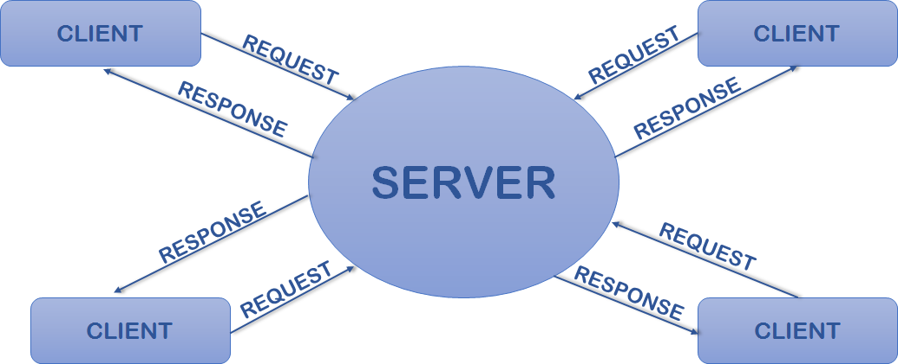
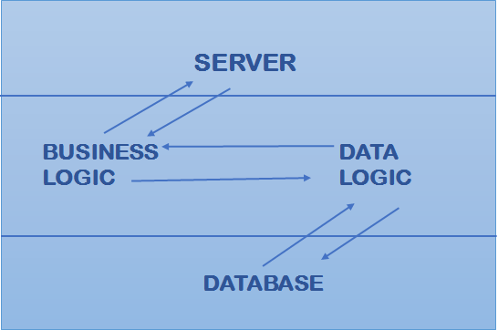
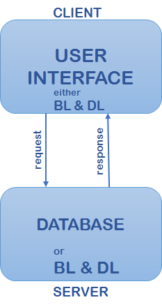
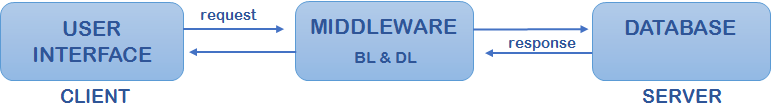

# 4th Semester Assignments Questions
## Given By - 
 - Gokul Singh Bisht
 - Miss Anjali Dhiman
 - Miss Pooja Negi

### RDBMS Assignment 01 | Questions
 1.	Explain transaction with its lifecycle ?
 2.	Explain deadlock with detection and avoidance ?
 3.	What are the ACID properties ?
 4.	Define schedule with its type ?
 5.	Explain testing of serializability ?
 6.	Define each failure classification ?

### Multimedia Assignment Questions
 1.	What is multimedia? Describe components of multimedia?
 2.	What are software and hardware requirements for multimedia computer? Discuss multimedia applications in business.
 3.	Explain the evolution of Multimedia and its objects.
 4.	Explain the scope of multimedia in business and work.
 5.	What is meant by multimedia and hypermedia?
 6.	What is sound card? Explain its principle and working.
 7.	What is digital video? Explain the use of digital video in developing multimedia application.
 8.	What is image capturing authoring tools/software? Explain the features of authoring tools/software.
 9.	Explain the process involved in planning and design of any multimedia application.
 10. What do you mean by MIDI? Explain in detail.
 11. What is digital Audio? Explain about digital audio formats.
 12. What do you mean by hypertext? What are elements of hypertext? How hypertext is different from hypermedia?
 13. What do you mean by macromedia products? Explain its some basic drawing techniques?

 ### RDBMS Assignment 02 | Questions
1. Define Data Dictionary?
    > A Data Dictionary is a collection of names, definitions, and attributes about data elements that are being used or captured in a database, information system, or part of a research project. It describes the meanings and purposes of data elements within the context of a project, and provides guidance on interpretation, accepted meanings and representation. A Data Dictionary also provides metadata about data elements. The metadata included in a Data Dictionary can assist in defining the scope and characteristics of data elements, as well the rules for their usage and application. 

 2. Define each keys with example: 
      1. Primary key
         - Primary Key – is a column or group of columns in a table that uniquely identify every row in that table.

    2. Foreign key 
         - Foreign Key – is a column that creates a relationship between two tables. The purpose of Foreign keys is to maintain data integrity and allow navigation between two different instances of an entity.

    3. Candidate key
         - Candidate Key – is a set of attributes that uniquely identify tuples in a table. Candidate Key is a super key with no repeated attributes.

    4. Super key
         - Super Key – A super key is a group of single or multiple keys which identifies rows in a table.
    5. Alternate Key
         - Alternate Key – is a column or group of columns in a table that uniquely identify every row in that table.
    6. Compound Key
         - Compound Key – has two or more attributes that allow you to uniquely recognize a specific record. It is possible that each column may not be unique by itself within the database.
    7. Composite Key
          - Composite Key – is a combination of two or more columns that uniquely identify rows in a table. The combination of columns guarantees uniqueness, though individual uniqueness is not guaranteed.
    8. Surrogate Key
         - Surrogate Key – An artificial key which aims to uniquely identify each record is called a surrogate key. These kind of key are unique because they are created when you don’t have any natural primary key.
    5. Refrential key
         - Note have any information about that.

 3. Explain Types of Client Server Architecture.
    > Client-Server Architecture is a distributed system architecture where the workload of client server are separated. 
    
    - 1 tier architecture - 1 Tier Architecture in DBMS is the simplest architecture of Database in which the client, server, and Database all reside on the same machine. A simple one tier architecture example would be anytime you install a Database in your system and access it to practice SQL queries.
     
     

    
    - 2 tier architecture - In a two-tier architecture, the client is on the first tier. The database server and web application server reside on the same server machine, which is the second tier. This second tier serves the data and executes the business logic for the web application.
    

    - 3 tier architecture - 3-tier architecture is a client-server architecture in which the functional process logic, data access, computer data storage and user interface are developed and maintained as independent modules on separate platforms.
    

 
 4. Define Distributed Database with both Fragmentation (Horizontal & Vertical)
    > Fragmentation is the task of dividing a table into a set of smaller tables. The subsets of the table are called fragments. Fragmentation can be of three types: horizontal, vertical, and hybrid (combination of horizontal and vertical).
    >> In vertical fragmentation, the fields or columns of a table are grouped into fragments. In order to maintain reconstructiveness, each fragment should contain the primary key field(s) of the table. Vertical fragmentation can be used to enforce privacy of data.
    
    >>Horizontal fragmentation groups the tuples of a table in accordance to values of one or more fields. Horizontal fragmentation should also confirm to the rule of reconstructiveness. Each horizontal fragment must have all columns of the original base table.